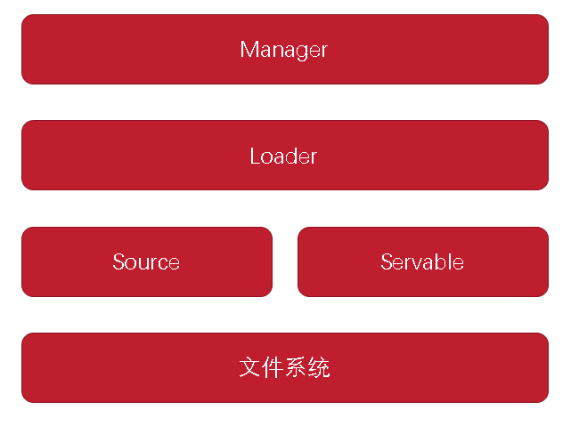
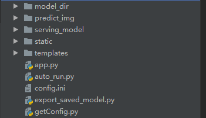

## 基于TensorFlow Serving的模型部署实践

&emsp;&emsp;在日常的生产应用中，我们需要将训练好的神经网络模型部署到生产环境中，并能够以服务的形式提供给生产应用。基于TensorFlow编写的神经网络模型部署有两种方案可以选择：一是基于flask等Web框架；而是基于TensorFlow Serving。本文将介绍使用TensorFlow Serving进行模型部署方案。 
### 1 TensorFlow Serving框架简介

&emsp;&emsp;TensorFlow Serving是一个高性能、开源的机器学习服务系统，为生产环境部署及更新TensorFlow模型而设计。TensorFlow Serving能够让训练好的模型更快、更易投入生产环境中使用，提供了高效、高可用的模型治理能力。 

&emsp;&emsp;TensorFlow Serving包含四个核心模块，分别是Servable、Source、Loader和Manager，以这四个模块为基础绘制出TensorFlow Serving的整体架构，如图所示 ： 

 

#### 1.1 Servable
&emsp;&emsp;Servable是用于执行计算的底层对象。单个Servable的大小和粒度是灵活可变的，因此其可以包括从单个模型到多个模型组合的所有的信息。为了保证灵活性和可扩展性，Servable可以是任意类型或者接口，比如Streaming result、Experimental API、Asynchronous modes of operation等。 

#### 1.2 Source

&emsp;&emsp;Source的作用是在文件系统中查找并提供Servable，每个Source可以提供多个Servable Stream，并会为每个Servable Stream提供一个Loader实例，使其可以被加载或者调用。 

&emsp;&emsp;Source可以在不同的文件系统中查找可用的Servable，并支持RPC协议进行远程调用。 

#### 1.3 Loader

&emsp;&emsp;Loader的作用是对Servable的生命周期进行管理。Loader API是一个独立于学习算法、数据或者产品用例的公共组件，并且可以使用标准化API来加载或消亡一个Servable。 

#### 1.3 Manager

&emsp;&emsp;Manager会监听Source来跟踪所有的Servable版本，在资源充足的情况下，Manager会加载从Source监听到的所有需要加载的Servable，但是当资源不足时会拒绝加载Servable的新请求。在Manager中支持基于策略的Servable卸载管理，当策略是保证所有时间至少有一个Servable版本被卸载时，在新的Servable完成加载前Manager会延迟卸载老版本的Servable。 

### 2 TensorFlow Serving环境搭建

&emsp;&emsp;TensorFlow Serving环境搭建有基于Docker和Ubuntu 16.04两种方式，其中基于Docker的搭建方式具有跨平台、操作简单的特点，但是屏蔽了搭建细节；基于Ubuntu 16.04的搭建方式则要求掌握一定的Linux环境和软件安装知识。 

#### 2.1 基于Docker搭建TensorFlow Serving环境

&emsp;&emsp;使用Docker搭建TensorFlow Serving环境是非常方便和快捷的，在安装好Docker环境之后，可以直接使用如下命令完成Docker镜像的下载和运行。 

	1. docker pull tensorflow/serving
	2. docker run -p  8500:8500 -p 8501:8501 --name tfserving_resnet \
	   --mount type=bind,source=/tmp/resnet,target=/models/resnet \
	   -e MODEL_NAME=resnet -t tensorflow/serving

&emsp;&emsp;其中，TensorFlow Serving默认的8500是gRPC端口，8501为REST API服务端口。 

#### 2.2 基于Ubuntu16.04搭建TensorFlow Servable环境

&emsp;&emsp;如果基于Ubuntu16.04或者其他Linux版本系统搭建TensorFlow Serving环境，则过程会稍微复杂一些，具体命令如下： 

	1. #先移除旧版本的TensorFlow Serving
	2. apt-get remove tensorflow-model-server
	3. #增加安装源
	4. apt-get install curl
	5. echo "deb [arch=amd64] http://storage.googleapis.com/tensorflow-serving-apt stable tensorflow-model-server 
	   tensorflow-model-server-universal" | sudo tee /etc/apt/sources.list.d/tensorflow-serving.list &&
	6. curl https://storage.googleapis.com/tensorflow-serving-apt/tensorflow-serving.release.pub.gpg | sudo 
	   apt-key add -
	7. #更新源并安装最新版本的TensorFlow server
	8. apt-get update && apt-get install tensorflow-model-server
	9. #安装完成后，需要更新TensorFlow Server版本
	10. apt-get upgrade tensorflow-model-server

### 3 API详解
&emsp;&emsp;在编程实战中，我们会使用到三个主要的API，分别是`tf.keras.models.load_model`、`tf.keras.experimental.export_saved_model`和`tf.keras.backend.set_learning_phase`。 

#### 3.1 tf.keras.models.load_model
&emsp;&emsp;`tf.keras.models.load_model`提供了模型文件的加载功能，在使用该API时可以配置如下参数。 

- filepath:配置模型文件的存储路径。
- custom_objects:配置自定义网络对象的名称，以重新恢复自定义的网络对象。
- compile：配置加载后的模型是否需要重新编译。

#### 3.1 tf.keras.experimental.export_saved_model
&emsp;&emsp;`tf.keras.experimental.export_saved_model`提供了模型的导出和保存 功能，为了能够使用TensorFlow Serving进行部署，需要使用`tf.keras.experimental`中的`export_saved_model`方法以固定的格式将重新加载模型导出。在使用该API时，可以配置的参数如下。 

- model：配置需要导出的模型，必须是`tf.keras.Model`。
- saved_model_path:配置模型导出的文件路径。
- custom_objects:配置自定义的神经网络对象的名称，比如自定义的网络层。
- serving_only：配置是否只进行模型部署，不再进行迭代训练，默认是否。

#### 3.1 tf.keras.backend.set_learning_phase
&emsp;&emsp;`tf.keras.backend.set_learning_phase`提供了在模型中学习模式的设置功能，可以将学习模式设置为0或者1,0代表测试模型，1代表训练模式。在使用该API时，可以配置的参数如下。 

- value：设置为0或者1,0代表测试模式，1代表训练模式。

### 4 项目工程结构设计
&emsp;&emsp;如图所示，整个项目工程结构分为两部分：文件夹和代码文件，在编程实践中强烈建议采用文件夹和代码文件的方式来设计项目工程结构。所谓的文件夹和代码文件的方式就是指所有的Python代码文件放在根目录下，其他需要存放的静态文件、训练集文件和模型文件等都放在文件夹中。 

 

&emsp;&emsp;本项目分三个部分，分别是模型文件导出模块，模型文件部署模块和Web应用模块。模型文件导出模块提供了将已经加载的模型导出TensorFlow Serving部署所需的文件；模型文件部署模块提供了TensorFlow Serving部署功能；Web应用模块提供了可视化人机相互功能。 

&emsp;&emsp;在文件夹中，model_dir存放训练完成的模型文件，predict_images存放我们上传的需要预测的图像，serving_model存放TensorFlow Serving部署所需的文件，static和templates存放Web应用程序所需的HTML、JS等静态文件。 
