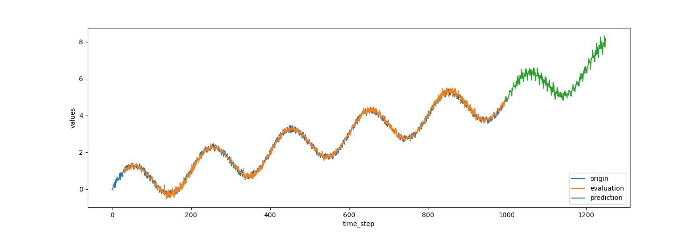

## 在TensorFlow中进行时间序列预测

&emsp;&emsp;常常会碰到各种各样的时间序列问题，如商场人流量的预测、商品价格的预测、股价的预测，等等。我们以TensorFlow中TensorFlow TIme Series库(简称为TFTS)为基础，它可以帮助我们在TensorFlow中快速搭建高性能的时间序列预测系统，并提供包括AR、LSTM在内的多个模型

### 1 时间序列问题的一般形式
&emsp;&emsp;一般地，时间序列数据抽象为两部分：观察的时间点和观察到的值。以商品价格为例，某年一月的价格为120元，二月的价格为130元，三月的价格为135元，四月的价格为132元。那么观察的时间点可以看作是1,2,3,4，而在各个时间点上观察到的数据的值为120,130,135,132。	 
&emsp;&emsp;观察的时间点可以不连续。比如二月的数据有缺失，那么实际的观察时间点为1,3,4，对应的数据为120,135,132。所谓时间序列预测，是指预测某些未来的时间点上（如5,6）数据的值应该是多少。 
&emsp;&emsp;TFTS库正是以按照 时间点+观察值的方式对时间序列问题进行抽象包装的。在TFTS中，观察的时间点用"times"表示，而对应的值用"values"表示。在训练模型时，输入数据需要同时具有times和values两个字段；在预测时，需要给定一些初始的数值，以及需要预测的时间点times。之后会对训练、预测的过程做进一步的介绍。
### 2 用TFTS读入时间序列数据
&emsp;&emsp;在训练模型之前，需要将时间序列数据读入成Tensor的形式。TFTS库中提供了两个方便读取器NumpyReader和CSVReader。前者用于从Numpy数组中读入数据，后者用于从CSV文件中读入数据。下面来分别介绍这两个函数。
#### 2.1 从Numpy数组中读入时间序列数据
&emsp;&emsp;这里提供一个示例文件test_input_array.py，将演示怎么读入Numpy数组中的时间序列数据。 
&emsp;&emsp;首先导入需要的包及函数： 
	
	# coding: utf-8
    from __future__ import print_function 
    import numpy as np
    import matplotlib
    matplotlib.use('agg')
    import matplotlib.pyplot as plt
    import tensorflow as tf
    from tensorflow.contrib.timeseries.python.timeseries import  NumpyReader

&emsp;&emsp;接着，利用np.sin生成一个实验用的时间序列数据。该时间数据实际上是在正弦曲线上加入了上升的趋势和一些随机的噪声： 
	
	x = np.array(range(1000))
	noise = np.random.uniform(-0.2, 0.2, 1000)
	y = np.sin(np.pi * x / 100) + x / 200. + noise
	plt.plot(x, y)
	plt.savefig('timeseries_y.jpg')	

该实验用的时间序列的图像被保存为"timeseries_y.jpg"文件，如图所示。 

 

&emsp;&emsp;横坐标对应变量"x"，纵坐标对应变量"y"，它们分别对应之前提到过的"观察的时间点"和"观察到值"。TFTS读入x和y的方式非常简单，请看下面代码： 

	data = {
   		tf.contrib.timeseries.TrainEvalFeatures.TIMES: x,
    	tf.contrib.timeseries.TrainEvalFeatures.VALUES: y,
	}

	reader = NumpyReader(data)

&emsp;&emsp;首先把x和y变成Python中的字典(变量data)。变量data中的键值`tf.contrib.timeseries.TrainEvalFeatures.TIMES`实际是一个字符串"times",而`tf.contrib.timeseries.TrainEvalFeatures.VALUES`是字符串"values"。所以，上面的定义直接写成`data={'times':x,'values':y}`也是可以的。写的比较复杂的形式是为了和源码中的写法保持一致。 

&emsp;&emsp;得到的reader有一个`read_full()`方法，它的返回值是时间序列对应的Tensor，可以用下面的代码进行试验： 

	with tf.Session() as sess:
    	full_data = reader.read_full()
    	coord = tf.train.Coordinator()
    	threads = tf.train.start_queue_runners(sess=sess, coord=coord)
    	print(sess.run(full_data))
    	coord.request_stop()

&emsp;&emsp;请注意，不能直接使用`sess.run(reader.read_full())`从reader中取出所以数据。原因在于 `read_full()`方法会产生读取队列，而队列的线程此时还没启动，需要`tf.train.start_queue_runners`启动队列，才能使用`sess.run()`来获取值。 

&emsp;&emsp;在训练时，通常不会使用整个数据集进行训练，而是采用batch的形式。从reader出发，建立batch数据的方法也很简单： 

	train_input_fn = tf.contrib.timeseries.RandomWindowInputFn(reader, batch_size=2, window_size=10)

&emsp;&emsp;`tf.contrib.timeseries.RandomWindowInputFn`会在reader的所有数据中，随机选取窗口长度为`window_size`的序列，并包装成`batch_size`大小的batch数据。换句话说，一个batch内共有`batch_size`个序列，每个序列的长度为`window_size`。 

&emsp;&emsp;以`batch_size=2, window_size=10`为例，可以打印出一个batch内的数据： 

	with tf.Session() as sess:
   		batch_data = train_input_fn.create_batch()
    	coord = tf.train.Coordinator()
    	threads = tf.train.start_queue_runners(sess=sess, coord=coord)
    	one_batch = sess.run(batch_data[0])
    	coord.request_stop()
	
	print('one_batch_data:', one_batch)

&emsp;&emsp;同之前一样，需要`tf.train.start_queue_runners`启动内部的队列。打出的一个batch的数据为： 

	one_batch_data: {'times': array([[ 1,  2,  3,  4,  5,  6,  7,  8,  9, 10],
       [52, 53, 54, 55, 56, 57, 58, 59, 60, 61]]), 'values': array([[[-0.12241605],
        [-0.08184543],
        [ 0.11040578],
        [ 0.09966263],
        [ 0.00607212],
        [ 0.26412606],
        [ 0.109269  ],
        [ 0.36322586],
        [ 0.12599526],
        [ 0.30097526]],

       [[ 1.21452269],
        [ 1.45361112],
        [ 1.44358888],
        [ 1.16028148],
        [ 1.09149246],
        [ 1.28153495],
        [ 1.41147888],
        [ 1.33760046],
        [ 1.41434313],
        [ 1.28628828]]])}

&emsp;&emsp;原先的数据长度为1000的时间序列`(x = np.array(range(1000)))`，使用`tf.contrib.timeseries.RandomWindowInputFn`，并指定`batch_size=2, window_size=10`的功能是在这长度为1000的时间序列中，随机选取长度为10的序列，并在每一个batch里包含两个这样的序列。这也可以从打印的数据中看出来。 

&emsp;&emsp;使用`tf.contrib.timeseries.RandomWindowInputFn`返回的train_input_fn可以进行训练了。这是在TFTS中读入Numpy数组时间序列的基本方式。下面介绍如何读入CSV格式的数据。 

#### 2.2 从CSV文件中读入时间序列数据
&emsp;&emsp;有时，时间序列数据是存储在CSV文件中的。当然可以将其先读入为Numpy数组，再使用之前的方法处理。更方便的做法是使用`tf.contrib.timeseries.CSVReader`读入。提供了一个test_input_csv.py代码，示例如何将文件`./data/period_trend.csv`中的时间序列读入。 

&emsp;&emsp;假设CSV文件的时间序列数据的形式为： 

	1，-0.6656603714
	2，-0.1164380359
	3，0.7398626488
	4，0.7368633029
	5，0.2289480898
	6，2.257073255
	7，3.023457405
	8，2.481161007
	9，3.773638612
	10，5.059257738
	11，3.553186083

&emsp;&emsp;CSV文件的第一列为时间点，第二列为该时间点上观察到的值。将其读入的方法为： 

	# coding: utf-8
	from __future__ import print_function
	import tensorflow as tf

	csv_file_name = './data/period_trend.csv'
	reader = tf.contrib.timeseries.CSVReader(csv_file_name)

&emsp;&emsp;实际读入的代码只有一行，直接使用函数`tf.contrib.timeseries.CSVReader`得到了reader。将reader 中所有数据打印出来的方法和之前是一样的： 

	with tf.Session() as sess:
    	data = reader.read_full()
    	coord = tf.train.Coordinator()
    	threads = tf.train.start_queue_runners(sess=sess, coord=coord)
    	print(sess.run(data))
    	coord.request_stop()

&emsp;&emsp;从reader出发，建立batch数据的train_input_fn的方法也完全相同： 

	train_input_fn = tf.contrib.timeseries.RandomWindowInputFn(reader, batch_size=4, window_size=16)

&emsp;&emsp;最后可以打印两个batch的数据进行测试： 

	with tf.Session() as sess:
    	data = train_input_fn.create_batch()
    	coord = tf.train.Coordinator()
    	threads = tf.train.start_queue_runners(sess=sess, coord=coord)
    	batch1 = sess.run(data[0])
    	batch2 = sess.run(data[0])
    	coord.request_stop()

	print('batch1:', batch1)
	print('batch2:', batch2)

&emsp;&emsp;以上是TFTS库中数据的读取方式，总的来说，会从Numpy数组或者CSV文件出发构造一个reader，再利用reader生成batch数据。最后得到的Tensor为train_input_fn ，这个train_input_fn会被当作训练时的输入。 

### 3 使用AR模型预测时间序列
#### 3.1 AR模型的训练
&emsp;&emsp;自回归模型(Autoregressive model,简称为AR模型)是统计学上处理时间序列模型的基本方法之一。TFTS中已经实现了一个自回归模型，对应的训练、验证并进行时间序列预测的示例程序为 train_array.py 。先仿照2.1定义一个train_input_fn： 

	x = np.array(range(1000))
    noise = np.random.uniform(-0.2, 0.2, 1000)
    y = np.sin(np.pi * x / 100) + x / 200. + noise
    plt.plot(x, y)
    plt.savefig('timeseries_y.jpg')
	
    data = {
        tf.contrib.timeseries.TrainEvalFeatures.TIMES: x,
        tf.contrib.timeseries.TrainEvalFeatures.VALUES: y,
    }

    reader = NumpyReader(data)

    train_input_fn = tf.contrib.timeseries.RandomWindowInputFn(reader, batch_size=16, window_size=40)

&emsp;&emsp;使用的时间序列数据如图所示（会被保存为"timeseries_y.jpg"）： 

 

&emsp;&emsp;针对这个序列，对应的AR模型的定义是： 

	ar = tf.contrib.timeseries.ARRegressor(
        periodicities=200, input_window_size=30, output_window_size=10,
        num_features=1,loss=tf.contrib.timeseries.ARModel.NORMAL_LIKELIHOOD_LOSS)

&emsp;&emsp;这里的几个参数比较重要。第一个参数是periodicities表示序列的规律性周期。在定义数据时使用的语句是`y = np.sin(np.pi* x / 100)+x / 200. + noise`，因此周期是200。input_window_size表示模型每次输入的值，output_window_size表示模型每次输出的值。input_window_size和output_window_size加起来必须等于train_input_fn中总的window_size。在这里总的window_size为40，input_window_size为30，output_window_size为10；也就是说一个batch内每个序列的长度为40，其中前30个数被当做模型的输入值，后10个数为这些输入对应的目标输出值。最后一个参数loss指定采取哪一种损失，一共有两种损失可以选择，分别是NORMAL_LIKELHOOD_LOSS和 SQUARED_LOSS。 

&emsp;&emsp;num_features参数表示在一个时间点上观察到的数的维度。这里每一步都是一个单独的值，所以num_features=1。 

&emsp;&emsp;除了程序中出现的几个参数外，还有一个比较重要的参数是model_dir。他表示模型训练好后保存的地址，如果不指定的话，会随机分配一个临时地址。 

&emsp;&emsp;使用变量ar的train方法可以直接进行训练 

	ar.train(input_fn=train_input_fn, steps=6000)

#### 3.2 AR模型的验证和预测
&emsp;&emsp;TFTS中验证(evaluation)的含义是：使用训练好的模型在原先训练集上进行计算，由此可以观察模型的拟合效果，对应的代码为： 

	evaluation_input_fn = tf.contrib.timeseries.WholeDatasetInputFn(reader)
    # keys of evaluation: ['covariance', 'loss', 'mean', 'observed', 'start_tuple', 'times', 'global_step']
    evaluation = ar.evaluate(input_fn=evaluation_input_fn, steps=1)

&emsp;&emsp;如果想要明白这里的逻辑，首先要理解之前定义的AR模型：他每次都接受一个长度为30的输入观测序列，并输出长度为10的预测序列。整个训练集是一个长度为1000的序列，前30个数首先被当做"初始观测序列"输入到模型中，由此可以计算出下面10步的预测值。接着又会取30个数进行预测，这30个数中有10个数是前一步的预测值，新得到的预测值又会变成下一步的输入，以此类推。 

&emsp;&emsp;最终得到970个预测值(970=1000-30,因为前30个数是没办法进行预测的)。970个预测值被记录在`evaluation['mean']`中。evaluation还有其他几个键值，如`evaluation['loss']`表示总的损失，`evaluation['times']`表示`evaluation['mean']`对应的时间点等等。 

&emsp;&emsp;`evaluation['start_tuple']`会被用于之后的预测中，它相当于最后30步输出值和对应的时间点。以此为起点，可以对1000步以后的值进行预测，对应代码为： 

	 (predictions,) = tuple(ar.predict(
        input_fn=tf.contrib.timeseries.predict_continuation_input_fn(evaluation, steps=250)))

&emsp;&emsp;这里的代码在1000步之后又向后预测了250个时间点。对应的值保存在`predictions['means']`中。可以把观察到的值、模型拟合的值、预测的值用下面的代码画出来： 

	plt.figure(figsize=(15, 5))
    plt.plot(data['times'].reshape(-1), data['values'].reshape(-1), label='origin')
    plt.plot(evaluation['times'].reshape(-1), evaluation['mean'].reshape(-1), label='evaluation')
    plt.plot(predictions['times'].reshape(-1), predictions['mean'].reshape(-1), label='prediction')
    plt.xlabel('time_step')
    plt.ylabel('values')
    plt.legend(loc=4)
    plt.savefig('predict_result.jpg')

&emsp;&emsp;画好的图片会被保存为"predict_result.jpg"，如图所示。 

 

&emsp;&emsp;从图可以看出，前1000步模型原始观测值的曲线和模型拟合值非常接近，说明模型拟合得已经比较好了，1000步之后的预测也合情合理。 

### 4 使用LSTM模型预测时间序列
&emsp;&emsp;给出两个用LSTM预测时间序列模型的例子，分别是train_lstm.py和train_lstm_multivariate.py。前者是在LSTM中进行单变量的时间序列预测，后者是使用LSTM进行多变量时间序列预测。为了使用LSTM模型，需要先使用TFTS库对其进行定义。 
#### 4.1 LSTM模型中的单变量时间序列预测
&emsp;&emsp;同样，用函数加噪声的方法生成一个模拟的时间序列数据： 

	x = np.array(range(1000))
	noise = np.random.uniform(-0.2, 0.2, 1000)
	y = np.sin(np.pi * x / 50 ) + np.cos(np.pi * x / 50) + np.sin(np.pi * x / 25) + noise

	data = {
      	tf.contrib.timeseries.TrainEvalFeatures.TIMES: x,
      	tf.contrib.timeseries.TrainEvalFeatures.VALUES: y,
	}

	reader = NumpyReader(data)

	rain_input_fn = tf.contrib.timeseries.RandomWindowInputFn(reader, batch_size=4, window_size=100)

&emsp;&emsp;此处y对x的函数关系比之前复杂，因此更适用于LSTM这样的模型找出其中的规律。得到y和x后，使用NumpyReader读入为Tensor形式，接着用`tf.contrib.timeseries.RandomWindowInputFn`将其变为batch训练数据。一个batch中有4个随机选取的序列，每个序列的长度为100。 

&emsp;&emsp;接下来定义一个LSTM模型： 

	 estimator = ts_estimators.TimeSeriesRegressor(model=_LSTMModel(num_features=1, num_units=128),
     		     optimizer=tf.train.AdamOptimizer(0.001))

&emsp;&emsp;`num_features=1`表示单标量时间序列，及每个时间点上观察到的量只是一个单独的数值，`num_units=128`表示使用隐层为128大小的LSTM模型。 

&emsp;&emsp;训练、验证和预测的方法都和之前类似。在训练时，在已有的1000步的观察量的基础上向后预测200步： 

	estimator.train(input_fn=train_input_fn, steps=2000)
	evaluation_input_fn = tf.contrib.timeseries.WholeDatasetInputFn(reader)
	evaluation = estimator.evaluate(input_fn=evaluation_input_fn, steps=1)
	# Predict starting after the evaluation
	(predictions,) = tuple(estimator.predict(input_fn=tf.contrib.timeseries.predict_continuation_input_fn(
          			 evaluation, steps=200)))

&emsp;&emsp;将验证、预测的结果取出并画成示意图，画出的图像会保存成"predict_result.jpg"文件： 

	observed_times = evaluation["times"][0]
	observed = evaluation["observed"][0, :, :]
	evaluated_times = evaluation["times"][0]
	evaluated = evaluation["mean"][0]
	predicted_times = predictions['times']
	predicted = predictions["mean"]
	
	plt.figure(figsize=(15, 5))
	plt.axvline(999, linestyle="dotted", linewidth=4, color='r')
	observed_lines = plt.plot(observed_times, observed, label="observation", color="k")
	evaluated_lines = plt.plot(evaluated_times, evaluated, label="evaluation", color="g")
	predicted_lines = plt.plot(predicted_times, predicted, label="prediction", color="r")
	plt.legend(handles=[observed_lines[0], evaluated_lines[0], predicted_lines[0]],loc="upper left")
	plt.savefig('predict_result.jpg')

&emsp;&emsp;预测效果如图所示，横坐标为时间轴，前1000步是训练数据，1000-1200步是模型预测的值 。 

 

#### 4.2 LSTM模型中的多变量时间序列预测
&emsp;&emsp;所谓多变量时间序列，是指在每个时间点上的观测值有多个值。在`data/multivariate_periods.csv`文件中保存了一个多变量时间序列的数据： 

	0	0.926906299771	1.99107237682	2.56546245685	3.07914768197	4.04839057867
	1	0.108010001864	1.41645361423	2.1686839775	2.94963962176	4.1263503303
	2	-0.800567600028	1.0172132907	1.96434754116	2.99885333086	4.04300485864
	3	0.0607042871898	0.719540073421	1.9765012584	2.89265588817	4.0951014426
	4	0.933712200629	0.28052120776	1.41018552514	2.69232603996	4.06481164223
	5	-0.171730652974	0.260054421028	1.48770816369	2.62199129293	4.44572807842
	6	-1.00180162933	0.333045158863	1.50006392277	2.88888309683	4.24755865606
	7	0.0580061875336	0.688929398826	1.56543458772	2.99840358953	4.52726873347

&emsp;&emsp;这个CSV文件的第一列是观察时间点，除此之外，每一行还有5个数，表示在这个时间点上观察到的数据。换句话说，时间序列上每一步都是一个5维的向量。 

&emsp;&emsp;使用TFTS读入该CSV文件的方法为： 

	csv_file_name = path.join("./data/multivariate_periods.csv")
	reader = tf.contrib.timeseries.CSVReader(csv_file_name,column_names=
            ((tf.contrib.timeseries.TrainEvalFeatures.TIMES,)
		    + (tf.contrib.timeseries.TrainEvalFeatures.VALUES,) * 5))
	train_input_fn = tf.contrib.timeseries.RandomWindowInputFn(reader, batch_size=4, window_size=32)

&emsp;&emsp;与之前的读入相比，唯一的区别是column_names参数。它告诉TFTS在CSV文件中，那些列表示时间，那些列表示观测量。 

&emsp;&emsp;接下来定义LSTM模型： 

	
	estimator = ts_estimators.TimeSeriesRegressor(
    	        model=_LSTMModel(num_features=5, num_units=128),
    			optimizer=tf.train.AdamOptimizer(0.001))

&emsp;&emsp;区别在于使用`num_features=5`而不是1，原因在于每个时间点上的观测量都是一个5维向量。 

&emsp;&emsp;训练、验证、预测以及画图的代码参照`train_lstm_multivariate.py`，最后的运行结果如图所示。 

 

&emsp;&emsp;图中前100步是训练数据，一条线代表观测量在一个维度上的取值，100步之后为预测值。 
