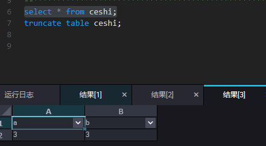
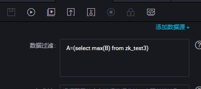
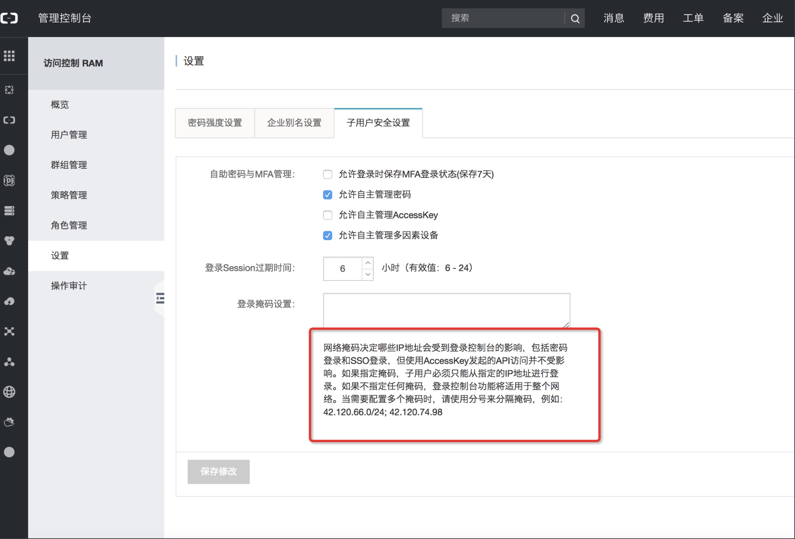
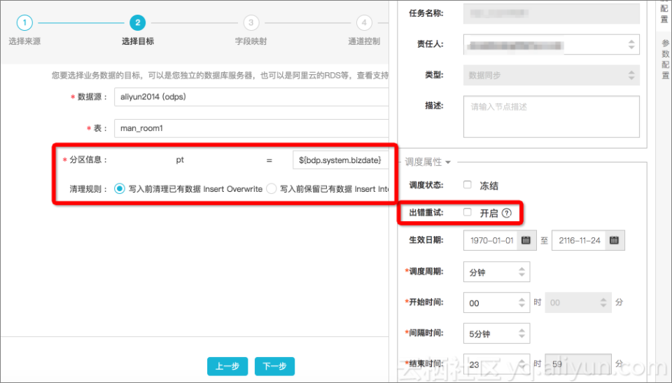
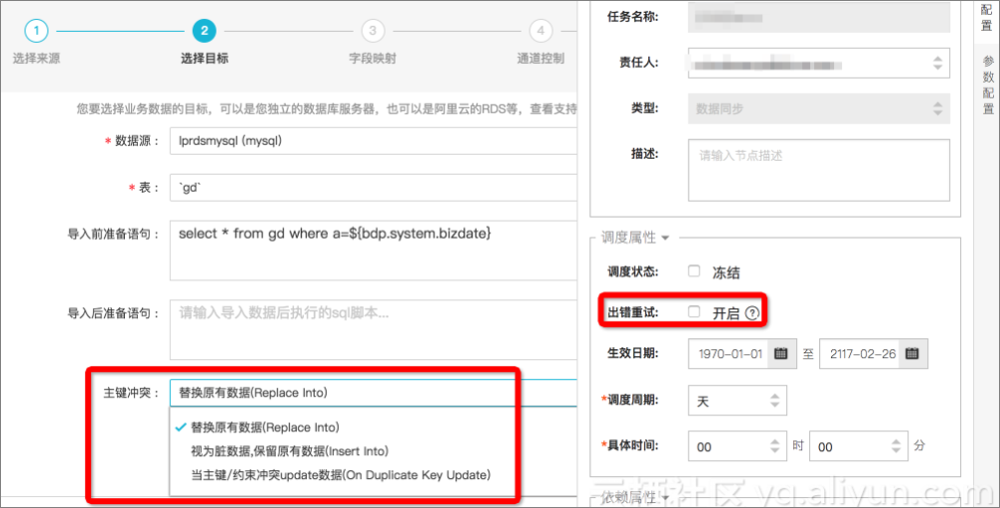
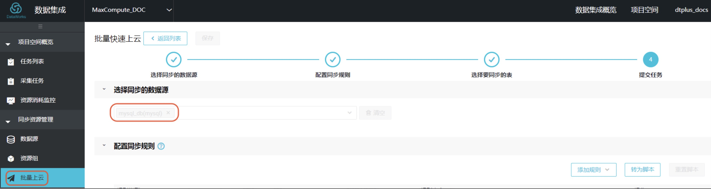
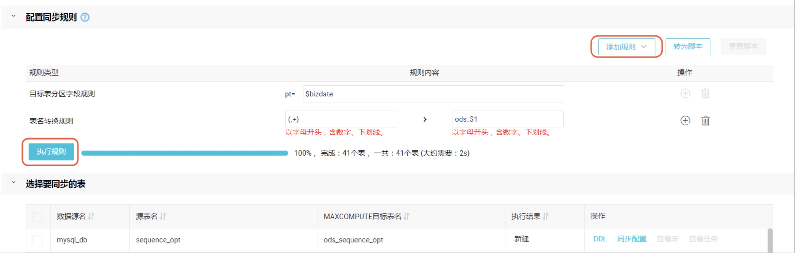
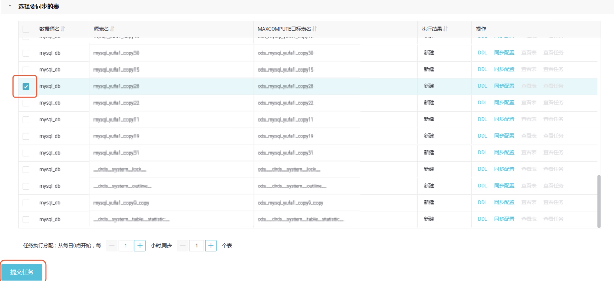
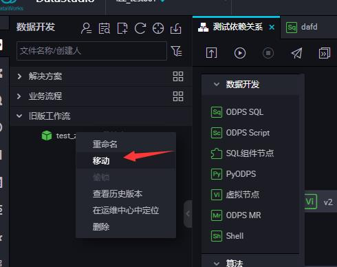
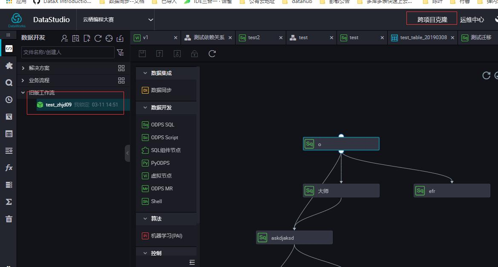

###1.Q：数据集成抽取ftp服务器文件，中文文件名称报权限错误，文件权限无问题，英文文件名无问题
问题描述：

1.同一个文件，使用 信号机经纬度 和qcgw_sgmn_lola 两个名字


2.中文报错日志


```
正在提交...
提交任务成功
正在等待在云端的gateway资源
2019-02-13 14:45:38 INFO Current task status:RUNNING
2019-02-13 14:45:38 INFO Start execute shell on node sh-base-biz-gateway20.cloud.et1.
2019-02-13 14:45:38 INFO Current working dir /home/admin/alisatasknode/taskinfo/20190213/datastudio/14/45/37/yyq69nc3lsn56vro70bqgvwg
2019-02-13 14:45:38 INFO Full Command ..
2019-02-13 14:45:38 INFO -------------------------
2019-02-13 14:45:38 INFO /home/admin/synccenter/datasync.py /home/admin/alisatasknode/taskinfo//20190213/datastudio/14/45/37/yyq69nc3lsn56vro70bqgvwg//main.sql
2019-02-13 14:45:38 INFO -------------------------
2019-02-13 14:45:38 INFO List of passing environment ..
2019-02-13 14:45:38 INFO -------------------------
2019-02-13 14:45:38 INFO ODPS_SQL_RETRY=false:
2019-02-13 14:45:38 INFO SKYNET_PTYPE=23:
2019-02-13 14:45:38 INFO SKYNET_ARGS=:
2019-02-13 14:45:38 INFO IS_NEW_SCHEDULE=true:
2019-02-13 14:45:38 INFO SKYNET_ONDUTY=242767246066165949:
2019-02-13 14:45:38 INFO SKYNET_SYSTEMID=dev:
2019-02-13 14:45:38 INFO SKYNET_SYSTEM_ENV=dev:
2019-02-13 14:45:38 INFO SKYNET_GMTDATE=20190213:
2019-02-13 14:45:38 INFO SKYNET_BIZDATE=20190213:
2019-02-13 14:45:38 INFO SKYNET_SOURCEID=:
2019-02-13 14:45:38 INFO SKYNET_PACKAGEID=audaque02:
2019-02-13 14:45:38 INFO SKYNET_APP_ID=88047:
2019-02-13 14:45:38 INFO SKYNET_ARGS_ENABLE=true:
2019-02-13 14:45:38 INFO SKYNET_TENANT_ID=310474894018624:
2019-02-13 14:45:38 INFO SKYNET_NODENAME=ftp_odps_qcgw_sgmn_lola_ls:
2019-02-13 14:45:38 INFO TASK_PLUGIN_NAME=ide_cdp:
2019-02-13 14:45:38 INFO ALISA_TASK_ID=T3_0731975125:
2019-02-13 14:45:38 INFO ALISA_TASK_EXEC_TARGET=group_310474894018624_dev:
2019-02-13 14:45:38 INFO ALISA_TASK_PRIORITY=0:
2019-02-13 14:45:38 INFO --- Invoking Shell command line now ---
2019-02-13 14:45:38 INFO =================================================================

2019-02-13 14:45:40 [INFO] Begin to fetch abtest info for tenant [310474894018624]
2019-02-13 14:45:40 [INFO] Fetch abtest info for tenant 310474894018624 , the result is {"data": true, "requestId": "0bc1603815500403400551939e", "errMsg": "success", "errCode": 0}
2019-02-13 14:45:40 [INFO] Use new di service...
2019-02-13 14:45:40 [INFO] Begin to route for data synchronization(current pid: 1)...
2019-02-13 14:45:40 [INFO] Environ variable replacement details: ${bdp.system.bizdate}->20190213
2019-02-13 14:45:40 [INFO] Origin variable replacement details:
2019-02-13 14:45:40 [INFO] Parsed variable replacement details(-p): []
2019-02-13 14:45:40 [INFO] Final Parsed variable replacement details: []
2019-02-13 14:45:40 [INFO] SKYNET_APP_ID:88047
2019-02-13 14:45:40 [INFO] ALISA_TASK_EXEC_TARGET:group_310474894018624_dev
2019-02-13 14:45:40 [INFO] SKYNET_SOURCENAME:None
2019-02-13 14:45:40 [INFO] ALISA_TASK_ID:T3_0731975125
2019-02-13 14:45:40 [INFO] JAVA_HOME:/opt/taobao/java
2019-02-13 14:45:40 [INFO] SKYNET_BIZDATE:20190213
2019-02-13 14:45:40 [INFO] SKYNET_CYCTIME:None
2019-02-13 14:45:40 [INFO] Data transport tunnel is DI.
2019-02-13 14:45:40 [INFO] DI job config file path: /home/admin/alisatasknode/taskinfo/20190213/datastudio/14/45/37/yyq69nc3lsn56vro70bqgvwg/T3_0731975125.di.json
2019-02-13 14:45:40 [INFO] Begin to get di pipeline with parameter projectId: [88047].
2019-02-13 14:45:40 [INFO] Begin to get di id and key with parameter projectId: [88047].
2019-02-13 14:45:40 [INFO] Configuration conversion correctly, begin to synchronize the data.

Alibaba DI Console, Build 201805310000 .
Copyright 2018 Alibaba Group, All rights reserved .
Start Job[46521867], traceId [310474894018624#88047#None#None#242767246066165949#None#None#ftp_odps_qcgw_sgmn_lola_ls], running in Pipeline[basecommon_group_310474894018624]
The Job[46521867] will run in PhysicsPipeline [basecommon_group_310474894018624_ecs] with requestId [ec3ab349-d9aa-45bf-a302-d24c28219981]
2019-02-13 14:45:42 : ---
Reader: ftp
                             path=[["/home/信号机经纬度.csv"]          ]
             fieldDelimiterOrigin=[,                             ]
                       datasource=[sftp                          ]
                           column=[[{"index":0,"name":0,"type":"string"},{"index":1,"name":1,"type":"string"},{"index":2,"name":2,"type":"string"},{"index":3,"name":3,"type":"string"}]]
                       skipHeader=[true                          ]
                         encoding=[GBK                           ]
                   fieldDelimiter=[,                             ]
                       fileFormat=[csv                           ]
Writer: odps
                         truncate=[true                          ]
                       datasource=[odps_first                    ]
                           column=[["crossid","pointx","pointy","whsj"]]
                      emptyAsNull=[true                          ]
                            table=[qcgw_sgmn_lola_ls             ]
Setting:
                       errorLimit=[{"record":""}                 ]
                            speed=[{"concurrent":2,"dmu":1,"throttle":false}]
2019-02-13 14:45:42 : State: 1(SUBMIT) | Total: 0R 0B | Speed: 0R/s 0B/s | Error: 0R 0B | Stage: 0.0%

2019-02-13 14:45:52 : State: 3(RUN) | Total: 0R 0B | Speed: 0R/s 0B/s | Error: 0R 0B | Stage: 0.0%

2019-02-13 14:46:02 : State: 4(FAIL) | Total: 0R 0B | Speed: 0R/s 0B/s | Error: 0R 0B | Stage: 0.0%
ErrorMessage:
Code:[FtpReader-04], Description:[您配置的目录文件路径不存在或者没有权限读取.]. - 请确认您的配置项path:[/home/信号机经纬度.csv]存在，且配置的用户有权限读取
2019-02-13 14:46:02 : DI run Job [46521867] failed.
2019-02-13 14:46:02 : ---
DI Submit at            : 2019-02-13 14:45:41
DI Start at             : 2019-02-13 14:45:49
DI Finish at            : 2019-02-13 14:45:53
2019-02-13 14:46:02 : Use "cdp job -log 46521867 [-p basecommon_group_310474894018624]" for more detail.
2019-02-13 14:45:49 INFO Current task status:RUNNING
2019-02-13 14:45:49 INFO Start execute shell on node iZ23ittmpopZ.
2019-02-13 14:45:49 INFO Current working dir /home/admin/alisatasknode/taskinfo/20190213/diide/14/45/43/0k0eckjtcrneekiebkmo94yv
2019-02-13 14:45:49 INFO Full Command ..
2019-02-13 14:45:49 INFO -------------------------
2019-02-13 14:45:49 INFO /home/admin/datax3/bin/datax.py  --jvm='-Xms1024m -Xmx1024m' -m local http://di-service-cn-shanghai.data.aliyun.com:80/api/inner/job/46521867/config
2019-02-13 14:45:49 INFO -------------------------
2019-02-13 14:45:49 INFO List of passing environment ..
2019-02-13 14:45:49 INFO -------------------------
2019-02-13 14:45:49 INFO SKYNET_APP_ID=88047:
2019-02-13 14:45:49 INFO SKYNET_ARGS=:
2019-02-13 14:45:49 INFO SKYNET_ARGS_ENABLE=true:
2019-02-13 14:45:49 INFO SKYNET_BIZDATE=20190213:
2019-02-13 14:45:49 INFO SKYNET_GMTDATE=20190213:
2019-02-13 14:45:49 INFO SKYNET_NODENAME=ftp_odps_qcgw_sgmn_lola_ls:
2019-02-13 14:45:49 INFO SKYNET_ONDUTY=242767246066165949:
2019-02-13 14:45:49 INFO SKYNET_PACKAGEID=audaque02:
2019-02-13 14:45:49 INFO SKYNET_PTYPE=23:
2019-02-13 14:45:49 INFO SKYNET_SOURCEID=:
2019-02-13 14:45:49 INFO SKYNET_SYSTEMID=dev:
2019-02-13 14:45:49 INFO SKYNET_SYSTEM_ENV=dev:
2019-02-13 14:45:49 INFO SKYNET_TENANT_ID=310474894018624:
2019-02-13 14:45:49 INFO mode=wizard:
2019-02-13 14:45:49 INFO resourceGroup=group_310474894018624:
2019-02-13 14:45:49 INFO TASK_PLUGIN_NAME=cdp:
2019-02-13 14:45:49 INFO ALISA_TASK_ID=T3_0731975186:
2019-02-13 14:45:49 INFO ALISA_TASK_EXEC_TARGET=group_310474894018624_ecs:
2019-02-13 14:45:49 INFO ALISA_TASK_PRIORITY=0:
2019-02-13 14:45:49 INFO --- Invoking Shell command line now ---
2019-02-13 14:45:49 INFO =================================================================
DataX (201901230000-1749365), From Alibaba !
Copyright (C) 2010-2017, Alibaba Group. All Rights Reserved.
2019-02-13 14:45:51.491 [main] INFO  VMInfo - VMInfo# operatingSystem class => sun.management.OperatingSystemImpl
2019-02-13 14:45:51.521 [main] INFO  Engine - the machine info  =>
        osInfo: Oracle Corporation 1.8 25.77-b03
        jvmInfo:        Linux amd64 2.6.18-308.el5
        cpu num:        16
        totalPhysicalMemory:    -0.00G
        freePhysicalMemory:     -0.00G
        maxFileDescriptorCount: -1
        currentOpenFileDescriptorCount: -1
        GC Names        [PS MarkSweep, PS Scavenge]
        MEMORY_NAME                    | allocation_size                | init_size
        PS Eden Space                  | 256.00MB                       | 256.00MB
        Code Cache                     | 240.00MB                       | 2.44MB
        Compressed Class Space         | 1,024.00MB                     | 0.00MB
        PS Survivor Space              | 42.50MB                        | 42.50MB
        PS Old Gen                     | 683.00MB                       | 683.00MB
        Metaspace                      | -0.00MB                        | 0.00MB
2019-02-13 14:45:51.564 [main] INFO  Engine -
{
        "job":{
                "content":[
                        {
                                "reader":{
                                        "name":"ftpreader",
                                        "parameter":{
                                                "column":[
                                                        {
                                                                "index":0,
                                                                "name":0,
                                                                "type":"string"
                                                        },
                                                        {
                                                                "index":1,
                                                                "name":1,
                                                                "type":"string"
                                                        },
                                                        {
                                                                "index":2,
                                                                "name":2,
                                                                "type":"string"
                                                        },
                                                        {
                                                                "index":3,
                                                                "name":3,
                                                                "type":"string"
                                                        }
                                                ],
                                                "configType":"1",
                                                "datasource":"sftp",
                                                "encoding":"GBK",
                                                "fieldDelimiter":",",
                                                "fieldDelimiterOrigin":",",
                                                "fileFormat":"csv",
                                                "gmtCreate":"2019-01-10 23:26:29",
                                                "host":"39.96.191.142",
                                                "password":"**********",
                                                "path":[
                                                        "/home/信号机经纬度.csv"
                                                ],
                                                "port":"22",
                                                "projectId":"88047",
                                                "protocol":"sftp",
                                                "skipHeader":"true",
                                                "subType":"",
                                                "tag":"public",
                                                "timeout":"90000",
                                                "type":"ftp",
                                                "username":"root"
                                        }
                                },
                                "writer":{
                                        "name":"odpswriter",
                                        "parameter":{
                                                "accessId":"LTAI2zDQsullzoGa",
                                                "accessKey":"******************************",
                                                "authType":"1",
                                                "column":[
                                                        "crossid",
                                                        "pointx",
                                                        "pointy",
                                                        "whsj"
                                                ],
                                                "datasource":"odps_first",
                                                "emptyAsNull":true,
                                                "endpoint":"http://service.odps.aliyun.com/api",
                                                "gmtCreate":"2019-01-10 22:54:33",
                                                "odpsServer":"http://service.odps.aliyun.com/api",
                                                "project":"audaque02_dev",
                                                "projectId":"88047",
                                                "subType":"",
                                                "table":"qcgw_sgmn_lola_ls",
                                                "truncate":true,
                                                "tunnelServer":"http://dt-ext.odps.aliyun-inc.com",
                                                "type":"odps"
                                        }
                                }
                        }
                ],
                "setting":{
                        "errorLimit":{},
                        "keyVersion":"zz_cdp_public_cluster",
                        "speed":{
                                "channel":2,
                                "concurrent":2,
                                "dmu":1,
                                "throttle":false
                        }
                }
        }
}
2019-02-13 14:45:51.604 [main] WARN  Engine - prioriy set to 0, because NumberFormatException, the value is: null
2019-02-13 14:45:51.608 [main] INFO  PerfTrace - PerfTrace traceId=job_46521867, isEnable=true, priority=0
2019-02-13 14:45:51.609 [main] INFO  JobContainer - DataX jobContainer starts job.
2019-02-13 14:45:51.612 [main] INFO  JobContainer - jobContainer starts to do preHandle ...
2019-02-13 14:45:51.612 [main] INFO  JobContainer - jobContainer starts to do init ...
2019-02-13 14:45:52.485 [job-46521867] WARN  OdpsWriter$Job - 这是一条需要注意的信息 由于您的作业配置了写入 ODPS 的目的表时emptyAsNull=true, 所以 DataX将会把长度为0的空字符串作为 java 的 null 写入 ODPS.
2019-02-13 14:45:52.486 [job-46521867] INFO  OdpsWriter$Job - blockSizeInMB=64.
2019-02-13 14:45:52.486 [job-46521867] INFO  JobContainer - jobContainer starts to do prepare ...
2019-02-13 14:45:52.486 [job-46521867] INFO  JobContainer - DataX Reader.Job [ftpreader] do prepare work .
2019-02-13 14:45:52.529 [job-46521867] ERROR SftpHelper - 请确认您的配置项path:[/home/信号机经纬度.csv]存在，且配置的用户有权限读取
com.jcraft.jsch.SftpException: No such file
        at com.jcraft.jsch.ChannelSftp.throwStatusError(ChannelSftp.java:2846) ~[jsch-0.1.51.jar:na]
        at com.jcraft.jsch.ChannelSftp._lstat(ChannelSftp.java:2309) ~[jsch-0.1.51.jar:na]
        at com.jcraft.jsch.ChannelSftp.lstat(ChannelSftp.java:2285) ~[jsch-0.1.51.jar:na]
        at com.alibaba.datax.plugin.reader.ftpreader.SftpHelper.isDirExist(SftpHelper.java:185) [ftpreader-0.0.1-SNAPSHOT.jar:na]
        at com.alibaba.datax.plugin.reader.ftpreader.SftpHelper.getListFiles(SftpHelper.java:259) [ftpreader-0.0.1-SNAPSHOT.jar:na]
        at com.alibaba.datax.plugin.reader.ftpreader.FtpHelper.getAllFiles(FtpHelper.java:126) [ftpreader-0.0.1-SNAPSHOT.jar:na]
        at com.alibaba.datax.plugin.reader.ftpreader.FtpReader$Job.prepare(FtpReader.java:208) [ftpreader-0.0.1-SNAPSHOT.jar:na]
        at com.alibaba.datax.core.job.JobContainer.prepareJobReader(JobContainer.java:938) [datax-core-0.0.1-SNAPSHOT.jar:na]
        at com.alibaba.datax.core.job.JobContainer.prepare(JobContainer.java:388) [datax-core-0.0.1-SNAPSHOT.jar:na]
        at com.alibaba.datax.core.job.JobContainer.start(JobContainer.java:165) [datax-core-0.0.1-SNAPSHOT.jar:na]
        at com.alibaba.datax.core.Engine.start(Engine.java:96) [datax-core-0.0.1-SNAPSHOT.jar:na]
        at com.alibaba.datax.core.Engine.entry(Engine.java:184) [datax-core-0.0.1-SNAPSHOT.jar:na]
        at com.alibaba.datax.core.Engine.main(Engine.java:217) [datax-core-0.0.1-SNAPSHOT.jar:na]
2019-02-13 14:45:52.531 [job-46521867] ERROR JobContainer - Exception when job run
com.alibaba.datax.common.exception.DataXException: Code:[FtpReader-04], Description:[您配置的目录文件路径不存在或者没有权限读取.]. - 请确认您的配置项path:[/home/信号机经纬度.csv]存在，且配置的用户有权限读取
        at com.alibaba.datax.common.exception.DataXException.asDataXException(DataXException.java:34) ~[datax-common-0.0.1-SNAPSHOT.jar:na]
        at com.alibaba.datax.plugin.reader.ftpreader.SftpHelper.isDirExist(SftpHelper.java:191) ~[ftpreader-0.0.1-SNAPSHOT.jar:na]
        at com.alibaba.datax.plugin.reader.ftpreader.SftpHelper.getListFiles(SftpHelper.java:259) ~[ftpreader-0.0.1-SNAPSHOT.jar:na]
        at com.alibaba.datax.plugin.reader.ftpreader.FtpHelper.getAllFiles(FtpHelper.java:126) ~[ftpreader-0.0.1-SNAPSHOT.jar:na]
        at com.alibaba.datax.plugin.reader.ftpreader.FtpReader$Job.prepare(FtpReader.java:208) ~[ftpreader-0.0.1-SNAPSHOT.jar:na]
        at com.alibaba.datax.core.job.JobContainer.prepareJobReader(JobContainer.java:938) ~[datax-core-0.0.1-SNAPSHOT.jar:na]
        at com.alibaba.datax.core.job.JobContainer.prepare(JobContainer.java:388) ~[datax-core-0.0.1-SNAPSHOT.jar:na]
        at com.alibaba.datax.core.job.JobContainer.start(JobContainer.java:165) ~[datax-core-0.0.1-SNAPSHOT.jar:na]
        at com.alibaba.datax.core.Engine.start(Engine.java:96) [datax-core-0.0.1-SNAPSHOT.jar:na]
        at com.alibaba.datax.core.Engine.entry(Engine.java:184) [datax-core-0.0.1-SNAPSHOT.jar:na]
        at com.alibaba.datax.core.Engine.main(Engine.java:217) [datax-core-0.0.1-SNAPSHOT.jar:na]
2019-02-13 14:45:53.082 [job-46521867] INFO  LocalJobContainerCommunicator - Total 0 records, 0 bytes | Speed 0B/s, 0 records/s | Error 0 records, 0 bytes |  All Task WaitWriterTime 0.000s |  All Task WaitReaderTime 0.000s | Percentage 0.00%
2019-02-13 14:45:53.084 [job-46521867] INFO  JobContainer - jobContainer starts to do destroy ...
2019-02-13 14:45:53.084 [job-46521867] INFO  JobContainer - DataX Writer.Job [odpswriter] do destroy work.
2019-02-13 14:45:53.084 [job-46521867] INFO  JobContainer - DataX Reader.Job [ftpreader] do destroy work.
2019-02-13 14:45:53.092 [job-46521867] ERROR Engine -
Through the intelligent analysis by DataX, the most likely error reason of this task is:
com.alibaba.datax.common.exception.DataXException: Code:[FtpReader-04], Description:[您配置的目录文件路径不存在或者没有权限读取.]. - 请确认您的配置项path:[/home/信号机经纬度.csv]存在，且配置的用户有权限读取
        at com.alibaba.datax.common.exception.DataXException.asDataXException(DataXException.java:34)
        at com.alibaba.datax.plugin.reader.ftpreader.SftpHelper.isDirExist(SftpHelper.java:191)
        at com.alibaba.datax.plugin.reader.ftpreader.SftpHelper.getListFiles(SftpHelper.java:259)
        at com.alibaba.datax.plugin.reader.ftpreader.FtpHelper.getAllFiles(FtpHelper.java:126)
        at com.alibaba.datax.plugin.reader.ftpreader.FtpReader$Job.prepare(FtpReader.java:208)
        at com.alibaba.datax.core.job.JobContainer.prepareJobReader(JobContainer.java:938)
        at com.alibaba.datax.core.job.JobContainer.prepare(JobContainer.java:388)
        at com.alibaba.datax.core.job.JobContainer.start(JobContainer.java:165)
        at com.alibaba.datax.core.Engine.start(Engine.java:96)
        at com.alibaba.datax.core.Engine.entry(Engine.java:184)
        at com.alibaba.datax.core.Engine.main(Engine.java:217)
2019-02-13 14:45:53 INFO =================================================================
2019-02-13 14:45:53 INFO Exit code of the Shell command 1
2019-02-13 14:45:53 INFO --- Invocation of Shell command completed ---
2019-02-13 14:45:53 ERROR Shell run failed!
2019-02-13 14:45:53 ERROR Current task status: ERROR
2019-02-13 14:45:53 INFO Cost time is: 3.843s
/home/admin/alisatasknode/taskinfo//20190213/diide/14/45/43/0k0eckjtcrneekiebkmo94yv/T3_0731975186.log-END-EOF
Return with failed!!
2019-02-13 14:46:03 [INFO] Sandbox context cleanup temp file success.
2019-02-13 14:46:03 [INFO] Data synchronization ended with return code: [1].
2019-02-13 14:46:03 INFO =================================================================
2019-02-13 14:46:03 INFO Exit code of the Shell command 1
2019-02-13 14:46:03 INFO --- Invocation of Shell command completed ---
2019-02-13 14:46:03 ERROR Shell run failed!
2019-02-13 14:46:03 ERROR Current task status: ERROR
2019-02-13 14:46:03 INFO Cost time is: 23.795s
/home/admin/alisatasknode/taskinfo//20190213/datastudio/14/45/37/yyq69nc3lsn56vro70bqgvwg/T3_0731975125.log-END-EOF
```
------
####A:初步问题分析：数据集成写入到后端吊起datax的jobconf文件中文编码与ftp服务器的系统的中文编码不一致。阿里人员在查数据集成后端代码，等待回复后更新。


### 2.Q：数据集成的where条件中可以支持嵌套子查询吗？

#### A:数据集成可以支持同数据源下的嵌套子查询





### 3.Q：如何控制只能从内网环境访问DataWorks控制台？

#### A:如果您希望您所在企业的用户只能通过企业内网访问DataWorks控制台，可以通过在RAM控制台中设置，仅放通您所在企业的内网地址映射出的公网地址实现，如下图所示。



### 4.Q：如何在dataworks数据同步中实现幂等？

#### A:在Dataworks中，数据的同步通过数据集成模块来实现。在数仓中，数据同步包括数据导入到数仓和数据从数仓中导出两种场景。

#### 数据导入的场景要实现幂等性比较容易。首先我们对于导入数据，建议把每天新增的数据导入到新的一个分区里，然后只需要设置导入的MaxCompute表的清洗规则为写入前清理已有数据Insert Overwr即可。这样数据在导入的过程中会先清空数据后再导入，从而实现幂。



#### 数据导出的场景，如果数据是全量导出的，也可以用类似数据导入的方法，配置导入前准备语句，把原来的数据全部删除后重新导入。另外如果数据源支持主键冲突设置时，可以通过主键冲突设置成Replace Into来实现数据的替换。




#### 由上图可见，目前Dataworks本身就支持设置出错重试，如果同步作业满足幂等性要求的，可以大胆开启这个设置，从而降低运维成本提高稳定性。

### 5.Q：小时依赖天任务，怎么让天任务不用等全部的小时任务都运行就运行起来？

#### A:将小时任务设置自依赖，这样天任务到时间就能运行了。

### 6.Q：批量上云时给目标表名加上前缀？

#### A:1).新建批量快速上云任务，并选择您创建的数据源。



####  2).单击添加规则，选择表名转换规则，输入您的表名转换正则表达式。本示例中使用(.+)匹配所有表头，使用(ods_$1)表示给表头加上前缀ods_。

#### 3).完成设置后，单击执行规则，您即可下方选择要同步的表处看到，表名已经进行了转换。



#### 4).勾选您需要同步的表，单击执行任务，即可在批量上云时完成对表前缀的设置。


### 7.Q：dataworks从旧版本升级到2.0，有没有比较好的作业迁移方案将旧的工作流升级为2.0里面的业务流程？

#### A：通过工作流的移动或者跨项目的克隆可以实现



跨项目克隆，相关的原理可以查看文档：https://help.aliyun.com/document_detail/92403.html?spm=a2c4g.11186623.6.655.55fe3467pKD6kF

###8.政务云同步任务脚本配置范例

```
{
    "configuration": {
        "reader": {
            "plugin": "odps",
            "parameter": {
                "datasource": "odps_first",
                "table": "qcgw_flowdetr_ipmont_cyrslt",
                "column": [
                    "crossid",
                    "crossname",
                    "locationtype",
                    "code",
                    "ip",
                    "whsj",
                    "old_new"
                ]
            }
        },
        "writer": {
            "plugin": "mysql",
            "parameter": {
                "datasource": "aduaque02",
                "table": "qcgw_flowdetr_ipmont_cyrslt",

                "column": [
                    "crossid",
                    "crossname",
                    "locationtype",
                    "code",
                    "ip",
                    "whsj",
                    "old_new"
                ],
                "postSql": [
                    "UPDATE qcgw_flowdetr_ipmont_ysj qfiy SET qfiy.end_date = CURRENT_TIMESTAMP (),qfiy.is_effect = 0 WHERE(qfiy.crossid,qfiy.crossname,qfiy.locationtype,qfiy.code,qfiy.ip) IN (SELECT qfic.crossid,qfic.crossname,qfic.locationtype,qfic.code,qfic.ip FROM qcgw_flowdetr_ipmont_cyrslt qfic WHERE qfic.old_new = 0);",
                    "INSERT INTO qcgw_flowdetr_ipmont_ysj (crossid,crossname,locationtype,code,ip) SELECT qfic.crossid,qfic.crossname,qfic.locationtype,qfic.code,qfic.ip FROM qcgw_flowdetr_ipmont_cyrslt qfic WHERE qfic.old_new = 1;",
                    "truncate table qcgw_flowdetr_ipmont;",
                    "INSERT INTO qcgw_flowdetr_ipmont (crossid,crossname,locationtype,code,ip,whsj) SELECT qfiy.crossid,qfiy.crossname,qfiy.locationtype,qfiy.code,qfiy.ip,qfiy.begin_date FROM qcgw_flowdetr_ipmont_ysj qfiy WHERE qfiy.is_effect = 1;",
                    "UPDATE qcgw_flowdetr_ipmont qfi SET qfi.is_clean = 1 WHERE qfi.crossid = 9999 OR qfi.crossname = '9999' OR qfi.locationtype = '9999' OR qfi.code = '9999' OR qfi.ip = '9999';"
                ],
                "truncate": false
            }
        },
        "setting": {
            "speed": {
                "mbps": 1
            },
            "errorLimit": {}
        }
    },
    "type": "job", 
    "version": "1.0"
}
```
###9.Q: 政务云生产环境和测试环境完全隔离

#### A: 数据源，模型都需要重新创建 任务则需要提交到审批队列 经审批通过后 才能上线即到生产环境。

###10.Q: 联合主键和无主键表的数据同步，切分字段怎么处理？

#### A：切分字段可以是表中任意字段，目的是为了使并发传送的包切分起来数据量分布均匀，减少长尾效应。

###10.Q: 联合主键和无主键表的数据同步，切分字段怎么处理？

#### A：切分字段可以是表中任意字段，目的是为了使并发传送的包切分起来数据量分布均匀，减少长尾效应。

###11.Q: 通过DataWorks的安全中心模块可以申请什么权限？

#### A：您可通过安全中心页面申请DataWorks工作空间内的表权限，包括开发环境和生产环境。

###12.Q: 数据管理和安全中心是什么关系？

#### A：安全中心是数据管理中与权限和安全相关功能的升级替代产品。此前已经在数据管理模块中申请的权限和通过odpscmd grant命令授权的权限，仍可在安全中心 > 我的权限中显示。如果您需通过可视化的方式进行新的权限申请、审批操作，请进入安全中心进行操作，数据管理模块后续将不再支持权限的申请和审批。

###13.Q: 为什么在申请时，有时可以选择字段，有时不可以选择？

#### A：如果该工作空间开启了LabelSecurity，即可在申请时选择字段，未开启则只能整表申请。

###14.Q: 提交申请后，需要谁进行审批？

#### A：提交的申请需要项目管理员或表Owner进行审批，其中任何一个审批通过/拒绝，则审批完成。

###15.Q: 为什么提交了一个申请，在我的申请中却看到两个申请单？

#### A：因为您的申请单中包含的数据表的表Owner不同，安全中心会按照表Owner对于申请单自动进行拆分。

###16.Q: 为什么有的字段只申请1个月权限，审批完成后查看变为永久？

#### A：说明字段的安全等级为0或者小于等于您账号的安全等级。

###17.Q: 为什么有的表和字段没有申请权限，但能看到有权限？

#### A：出现此情况有以下两种可能：1.除安全中心外，管理员还可通过控制台命令行给您授权。2.如果您是通过安全中心进行了申请，则说明字段的安全等级为0或者小于等于您账号的安全等级。

###18.Q: 为什么并没有审批某个待我审批中的申请单，却没有了？

#### A：因为申请单由项目管理员或表Owner进行审批，其他项目管理员或表Owner在您之前完成了审批，因此该申请单已成为完结状态，便从您的待我审批中消失了。

###19.Q: 查询某个工作空间和环境，提示MaxCompute项目异常，无法进行操作，该如何处理？

#### A：请将提示框及框内的错误编码发给项目管理员，由他进行问题的排查及解决。

###20.Q: 为什么交还/回收某个字段权限却无效？

#### A：只能交还/回收字段的安全等级大于账号安全等级的字段，对于安全等级为0或者小于等于账号安全等级的字段，无法进行字段权限的交还/回收。

###21.Q: 为什么主账号不能申请权限？

#### A：主账号默认具有所有权限，无需单独申请权限，因此对主账号无需的操作，如申请权限等进行隐藏，不会影响到主账号的正常使用。

###22.Q: 是否可以在安全中心页面查看以前在数据管理页面的申请/审批记录？

#### A：目前安全中心和数据管理中的申请/审批记录没有进行关联，如果需要查看在数据管理进行申请/审批的历史记录，请跳转至数据管理页面进行查看。

###23.Q: 是否必须开通API网关？

#### A：API网关提供了API托管服务，如果您的API计划对外开放调用，则必须先开通API网关服务。

###24.Q: 数据源在哪里配置？

#### A：数据源需要在DataWorks数据集成数据源中进行配置。配置好后，数据服务会自动读取数据源信息。

###25.Q: 向导模式生成API与脚本模式有何功能差异？

#### A：脚本模式的功能更为强大，详情请参见脚本模式生成API。
#### https://help.aliyun.com/document_detail/73279.html?spm=a2c4g.11186623.2.7.40d91fccItZADv#concept-gpn-xc3-r2b

###26.Q: 数据服务中的API分组是干什么用的，与API网关中的分组有什么关联？

#### A：API分组一个特定功能或场景的API集合，是数据服务中API的最小组织单元，对应于API网关中的分组概念。简单来说，二者是等同的。数据服务中的API发布到API网关时，系统会在API网关中自动创建一个同名的分组。

###27.Q: 如何设置API分组比较合理？

#### A：一般将解决同一个问题或者相似功能的API放在一个分组当中。例如根据城市名称查看天气API与根据经纬度查询天气API这两个就可以放在一个名为天气查询的API分组中。

###28.Q: 最多可以创建多少个API分组？

#### A：目前一个云账号下最多可创建100个API分组。

###29.Q: 什么情况下要开启API返回结果分页功能？

#### A：默认情况下，API最多只会返回500条查询结果。因此当API返回结果有可能超过500条时，请开启返回结果分页功能。当API无请求参数时，一般返回结果会比较多，系统会强制开启返回结果分页。

###30.Q: 生成API是否支持POST请求？

#### A：生成API当时仅支持GET请求。

###31.Q: 是否支持HTTPS协议？

#### A：当前尚不支持HTTPS，在后续的版本迭代中有可能会支持HTTPS，敬请期待。

###32.Q: 运维中心智能监控中我的报警为什么报给了别人？

#### A：1.对于自定义设置的报警，请和自定义提醒的创建人确认规则问题。2.对于开启基线开关后基线产生的报警，可以查看具体的事件页面，在事件页面的下方会说明报警的指派原因。3.如果任务所在项目关联了值班表，会优先报给值班表接收人。如果没有值班表，则查看个人身上是否挂有值班表，如果也没有，才会报警给责任人自己。

###33.Q: 运维中心智能监控中基线开关开启的的基线破线了为什么没有报警？

#### A：基线开关开启的的基线监控是针对任务的。如果所有的任务都正常，即使破线也不会报警，因为所有的任务都运行正常，无法判断出哪个任务出错。
#####任务都正常但基线还破线的原因通常有以下两点。
##### 1.基线时间设置的不合理。
##### 2.任务的依赖有问题，即使基线破线也不报警。

###34.Q: 运维中心智能监控中为什么任务出错了但没有收到报警？

#### A：并不是所有任务出错了都会报警，任务只有满足下述条件之一才会出错后进行报警。1.处于某条基线开关开启的基线的上游。2.设置了相关的自定义提醒规则。

###35.Q: 运维中心智能监控中任务不重要，不想接收报警该怎么办？

#### A：单击事件管理页面中的详情，即可看到任务影响的下游基线。这些基线的范围内如果出现问题可能导致任务报警，请联系相应基线负责人。

###36.Q: 运维中心智能监控中我的任务变慢了，能不能不报警？

#### A：任务变慢报警一定要满足以下两个条件。1.任务处于重要的基线上游。2.任务和往常比较确实存在变慢的情况。
##### 如果任务变慢影响不大，可以选择忽略，请和下游监控了任务的基线方确认（下游基线信息可以在事件管理页面中看到）。如果确认要为下游方负责，请维护好任务。

###37.Q: 运维中心智能监控中夜间收到了报警怎么办？

#### A：夜间收到报警，可以登录事件页面关闭事件报警一段时间。但只能关闭报警一段时间，收到报警后还应及时处理问题。

###38.Q: 添加RDS数据源时为什么白名单已添加，依然报错提示user not exist ip white list reference？

#### A：出现这种情况通常是由于用户名输入错误。您可以参考创建账号和数据库检查自己输入的用户名是否正确。

###39.Q: 等待槽位或Gateway问题说明？

#### A：在可满足业务诉求的前提下，建议您 合理安排任务错峰运行，以便在各个时间段分利用已购买的计算资源。 如需获得更高任务并发调度能力，请将如下内容提交工单以进行评估：1.业务场景2.期望的高峰期DataWorks任务并发量3.任务无法错峰运行的原因

