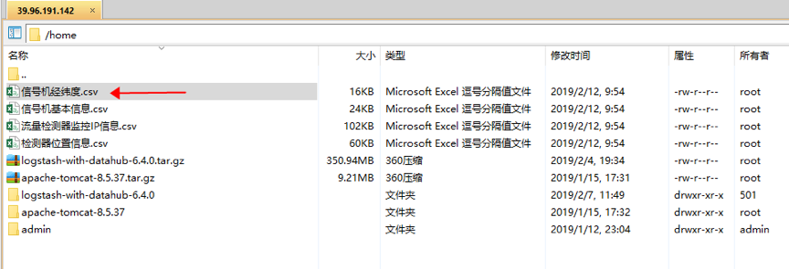
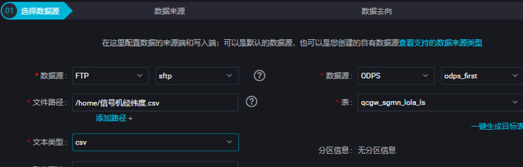

###1.Q：数据集成抽取ftp服务器文件，中文文件名称报权限错误，文件权限无问题，英文文件名无问题
问题描述：

1.同一个文件，使用 信号机经纬度 和qcgw_sgmn_lola 两个名字


2.中文报错日志


```
正在提交...
提交任务成功
正在等待在云端的gateway资源
2019-02-13 14:45:38 INFO Current task status:RUNNING
2019-02-13 14:45:38 INFO Start execute shell on node sh-base-biz-gateway20.cloud.et1.
2019-02-13 14:45:38 INFO Current working dir /home/admin/alisatasknode/taskinfo/20190213/datastudio/14/45/37/yyq69nc3lsn56vro70bqgvwg
2019-02-13 14:45:38 INFO Full Command ..
2019-02-13 14:45:38 INFO -------------------------
2019-02-13 14:45:38 INFO /home/admin/synccenter/datasync.py /home/admin/alisatasknode/taskinfo//20190213/datastudio/14/45/37/yyq69nc3lsn56vro70bqgvwg//main.sql
2019-02-13 14:45:38 INFO -------------------------
2019-02-13 14:45:38 INFO List of passing environment ..
2019-02-13 14:45:38 INFO -------------------------
2019-02-13 14:45:38 INFO ODPS_SQL_RETRY=false:
2019-02-13 14:45:38 INFO SKYNET_PTYPE=23:
2019-02-13 14:45:38 INFO SKYNET_ARGS=:
2019-02-13 14:45:38 INFO IS_NEW_SCHEDULE=true:
2019-02-13 14:45:38 INFO SKYNET_ONDUTY=242767246066165949:
2019-02-13 14:45:38 INFO SKYNET_SYSTEMID=dev:
2019-02-13 14:45:38 INFO SKYNET_SYSTEM_ENV=dev:
2019-02-13 14:45:38 INFO SKYNET_GMTDATE=20190213:
2019-02-13 14:45:38 INFO SKYNET_BIZDATE=20190213:
2019-02-13 14:45:38 INFO SKYNET_SOURCEID=:
2019-02-13 14:45:38 INFO SKYNET_PACKAGEID=audaque02:
2019-02-13 14:45:38 INFO SKYNET_APP_ID=88047:
2019-02-13 14:45:38 INFO SKYNET_ARGS_ENABLE=true:
2019-02-13 14:45:38 INFO SKYNET_TENANT_ID=310474894018624:
2019-02-13 14:45:38 INFO SKYNET_NODENAME=ftp_odps_qcgw_sgmn_lola_ls:
2019-02-13 14:45:38 INFO TASK_PLUGIN_NAME=ide_cdp:
2019-02-13 14:45:38 INFO ALISA_TASK_ID=T3_0731975125:
2019-02-13 14:45:38 INFO ALISA_TASK_EXEC_TARGET=group_310474894018624_dev:
2019-02-13 14:45:38 INFO ALISA_TASK_PRIORITY=0:
2019-02-13 14:45:38 INFO --- Invoking Shell command line now ---
2019-02-13 14:45:38 INFO =================================================================

2019-02-13 14:45:40 [INFO] Begin to fetch abtest info for tenant [310474894018624]
2019-02-13 14:45:40 [INFO] Fetch abtest info for tenant 310474894018624 , the result is {"data": true, "requestId": "0bc1603815500403400551939e", "errMsg": "success", "errCode": 0}
2019-02-13 14:45:40 [INFO] Use new di service...
2019-02-13 14:45:40 [INFO] Begin to route for data synchronization(current pid: 1)...
2019-02-13 14:45:40 [INFO] Environ variable replacement details: ${bdp.system.bizdate}->20190213
2019-02-13 14:45:40 [INFO] Origin variable replacement details:
2019-02-13 14:45:40 [INFO] Parsed variable replacement details(-p): []
2019-02-13 14:45:40 [INFO] Final Parsed variable replacement details: []
2019-02-13 14:45:40 [INFO] SKYNET_APP_ID:88047
2019-02-13 14:45:40 [INFO] ALISA_TASK_EXEC_TARGET:group_310474894018624_dev
2019-02-13 14:45:40 [INFO] SKYNET_SOURCENAME:None
2019-02-13 14:45:40 [INFO] ALISA_TASK_ID:T3_0731975125
2019-02-13 14:45:40 [INFO] JAVA_HOME:/opt/taobao/java
2019-02-13 14:45:40 [INFO] SKYNET_BIZDATE:20190213
2019-02-13 14:45:40 [INFO] SKYNET_CYCTIME:None
2019-02-13 14:45:40 [INFO] Data transport tunnel is DI.
2019-02-13 14:45:40 [INFO] DI job config file path: /home/admin/alisatasknode/taskinfo/20190213/datastudio/14/45/37/yyq69nc3lsn56vro70bqgvwg/T3_0731975125.di.json
2019-02-13 14:45:40 [INFO] Begin to get di pipeline with parameter projectId: [88047].
2019-02-13 14:45:40 [INFO] Begin to get di id and key with parameter projectId: [88047].
2019-02-13 14:45:40 [INFO] Configuration conversion correctly, begin to synchronize the data.

Alibaba DI Console, Build 201805310000 .
Copyright 2018 Alibaba Group, All rights reserved .
Start Job[46521867], traceId [310474894018624#88047#None#None#242767246066165949#None#None#ftp_odps_qcgw_sgmn_lola_ls], running in Pipeline[basecommon_group_310474894018624]
The Job[46521867] will run in PhysicsPipeline [basecommon_group_310474894018624_ecs] with requestId [ec3ab349-d9aa-45bf-a302-d24c28219981]
2019-02-13 14:45:42 : ---
Reader: ftp
                             path=[["/home/信号机经纬度.csv"]          ]
             fieldDelimiterOrigin=[,                             ]
                       datasource=[sftp                          ]
                           column=[[{"index":0,"name":0,"type":"string"},{"index":1,"name":1,"type":"string"},{"index":2,"name":2,"type":"string"},{"index":3,"name":3,"type":"string"}]]
                       skipHeader=[true                          ]
                         encoding=[GBK                           ]
                   fieldDelimiter=[,                             ]
                       fileFormat=[csv                           ]
Writer: odps
                         truncate=[true                          ]
                       datasource=[odps_first                    ]
                           column=[["crossid","pointx","pointy","whsj"]]
                      emptyAsNull=[true                          ]
                            table=[qcgw_sgmn_lola_ls             ]
Setting:
                       errorLimit=[{"record":""}                 ]
                            speed=[{"concurrent":2,"dmu":1,"throttle":false}]
2019-02-13 14:45:42 : State: 1(SUBMIT) | Total: 0R 0B | Speed: 0R/s 0B/s | Error: 0R 0B | Stage: 0.0%

2019-02-13 14:45:52 : State: 3(RUN) | Total: 0R 0B | Speed: 0R/s 0B/s | Error: 0R 0B | Stage: 0.0%

2019-02-13 14:46:02 : State: 4(FAIL) | Total: 0R 0B | Speed: 0R/s 0B/s | Error: 0R 0B | Stage: 0.0%
ErrorMessage:
Code:[FtpReader-04], Description:[您配置的目录文件路径不存在或者没有权限读取.]. - 请确认您的配置项path:[/home/信号机经纬度.csv]存在，且配置的用户有权限读取
2019-02-13 14:46:02 : DI run Job [46521867] failed.
2019-02-13 14:46:02 : ---
DI Submit at            : 2019-02-13 14:45:41
DI Start at             : 2019-02-13 14:45:49
DI Finish at            : 2019-02-13 14:45:53
2019-02-13 14:46:02 : Use "cdp job -log 46521867 [-p basecommon_group_310474894018624]" for more detail.
2019-02-13 14:45:49 INFO Current task status:RUNNING
2019-02-13 14:45:49 INFO Start execute shell on node iZ23ittmpopZ.
2019-02-13 14:45:49 INFO Current working dir /home/admin/alisatasknode/taskinfo/20190213/diide/14/45/43/0k0eckjtcrneekiebkmo94yv
2019-02-13 14:45:49 INFO Full Command ..
2019-02-13 14:45:49 INFO -------------------------
2019-02-13 14:45:49 INFO /home/admin/datax3/bin/datax.py  --jvm='-Xms1024m -Xmx1024m' -m local http://di-service-cn-shanghai.data.aliyun.com:80/api/inner/job/46521867/config
2019-02-13 14:45:49 INFO -------------------------
2019-02-13 14:45:49 INFO List of passing environment ..
2019-02-13 14:45:49 INFO -------------------------
2019-02-13 14:45:49 INFO SKYNET_APP_ID=88047:
2019-02-13 14:45:49 INFO SKYNET_ARGS=:
2019-02-13 14:45:49 INFO SKYNET_ARGS_ENABLE=true:
2019-02-13 14:45:49 INFO SKYNET_BIZDATE=20190213:
2019-02-13 14:45:49 INFO SKYNET_GMTDATE=20190213:
2019-02-13 14:45:49 INFO SKYNET_NODENAME=ftp_odps_qcgw_sgmn_lola_ls:
2019-02-13 14:45:49 INFO SKYNET_ONDUTY=242767246066165949:
2019-02-13 14:45:49 INFO SKYNET_PACKAGEID=audaque02:
2019-02-13 14:45:49 INFO SKYNET_PTYPE=23:
2019-02-13 14:45:49 INFO SKYNET_SOURCEID=:
2019-02-13 14:45:49 INFO SKYNET_SYSTEMID=dev:
2019-02-13 14:45:49 INFO SKYNET_SYSTEM_ENV=dev:
2019-02-13 14:45:49 INFO SKYNET_TENANT_ID=310474894018624:
2019-02-13 14:45:49 INFO mode=wizard:
2019-02-13 14:45:49 INFO resourceGroup=group_310474894018624:
2019-02-13 14:45:49 INFO TASK_PLUGIN_NAME=cdp:
2019-02-13 14:45:49 INFO ALISA_TASK_ID=T3_0731975186:
2019-02-13 14:45:49 INFO ALISA_TASK_EXEC_TARGET=group_310474894018624_ecs:
2019-02-13 14:45:49 INFO ALISA_TASK_PRIORITY=0:
2019-02-13 14:45:49 INFO --- Invoking Shell command line now ---
2019-02-13 14:45:49 INFO =================================================================
DataX (201901230000-1749365), From Alibaba !
Copyright (C) 2010-2017, Alibaba Group. All Rights Reserved.
2019-02-13 14:45:51.491 [main] INFO  VMInfo - VMInfo# operatingSystem class => sun.management.OperatingSystemImpl
2019-02-13 14:45:51.521 [main] INFO  Engine - the machine info  =>
        osInfo: Oracle Corporation 1.8 25.77-b03
        jvmInfo:        Linux amd64 2.6.18-308.el5
        cpu num:        16
        totalPhysicalMemory:    -0.00G
        freePhysicalMemory:     -0.00G
        maxFileDescriptorCount: -1
        currentOpenFileDescriptorCount: -1
        GC Names        [PS MarkSweep, PS Scavenge]
        MEMORY_NAME                    | allocation_size                | init_size
        PS Eden Space                  | 256.00MB                       | 256.00MB
        Code Cache                     | 240.00MB                       | 2.44MB
        Compressed Class Space         | 1,024.00MB                     | 0.00MB
        PS Survivor Space              | 42.50MB                        | 42.50MB
        PS Old Gen                     | 683.00MB                       | 683.00MB
        Metaspace                      | -0.00MB                        | 0.00MB
2019-02-13 14:45:51.564 [main] INFO  Engine -
{
        "job":{
                "content":[
                        {
                                "reader":{
                                        "name":"ftpreader",
                                        "parameter":{
                                                "column":[
                                                        {
                                                                "index":0,
                                                                "name":0,
                                                                "type":"string"
                                                        },
                                                        {
                                                                "index":1,
                                                                "name":1,
                                                                "type":"string"
                                                        },
                                                        {
                                                                "index":2,
                                                                "name":2,
                                                                "type":"string"
                                                        },
                                                        {
                                                                "index":3,
                                                                "name":3,
                                                                "type":"string"
                                                        }
                                                ],
                                                "configType":"1",
                                                "datasource":"sftp",
                                                "encoding":"GBK",
                                                "fieldDelimiter":",",
                                                "fieldDelimiterOrigin":",",
                                                "fileFormat":"csv",
                                                "gmtCreate":"2019-01-10 23:26:29",
                                                "host":"39.96.191.142",
                                                "password":"**********",
                                                "path":[
                                                        "/home/信号机经纬度.csv"
                                                ],
                                                "port":"22",
                                                "projectId":"88047",
                                                "protocol":"sftp",
                                                "skipHeader":"true",
                                                "subType":"",
                                                "tag":"public",
                                                "timeout":"90000",
                                                "type":"ftp",
                                                "username":"root"
                                        }
                                },
                                "writer":{
                                        "name":"odpswriter",
                                        "parameter":{
                                                "accessId":"LTAI2zDQsullzoGa",
                                                "accessKey":"******************************",
                                                "authType":"1",
                                                "column":[
                                                        "crossid",
                                                        "pointx",
                                                        "pointy",
                                                        "whsj"
                                                ],
                                                "datasource":"odps_first",
                                                "emptyAsNull":true,
                                                "endpoint":"http://service.odps.aliyun.com/api",
                                                "gmtCreate":"2019-01-10 22:54:33",
                                                "odpsServer":"http://service.odps.aliyun.com/api",
                                                "project":"audaque02_dev",
                                                "projectId":"88047",
                                                "subType":"",
                                                "table":"qcgw_sgmn_lola_ls",
                                                "truncate":true,
                                                "tunnelServer":"http://dt-ext.odps.aliyun-inc.com",
                                                "type":"odps"
                                        }
                                }
                        }
                ],
                "setting":{
                        "errorLimit":{},
                        "keyVersion":"zz_cdp_public_cluster",
                        "speed":{
                                "channel":2,
                                "concurrent":2,
                                "dmu":1,
                                "throttle":false
                        }
                }
        }
}
2019-02-13 14:45:51.604 [main] WARN  Engine - prioriy set to 0, because NumberFormatException, the value is: null
2019-02-13 14:45:51.608 [main] INFO  PerfTrace - PerfTrace traceId=job_46521867, isEnable=true, priority=0
2019-02-13 14:45:51.609 [main] INFO  JobContainer - DataX jobContainer starts job.
2019-02-13 14:45:51.612 [main] INFO  JobContainer - jobContainer starts to do preHandle ...
2019-02-13 14:45:51.612 [main] INFO  JobContainer - jobContainer starts to do init ...
2019-02-13 14:45:52.485 [job-46521867] WARN  OdpsWriter$Job - 这是一条需要注意的信息 由于您的作业配置了写入 ODPS 的目的表时emptyAsNull=true, 所以 DataX将会把长度为0的空字符串作为 java 的 null 写入 ODPS.
2019-02-13 14:45:52.486 [job-46521867] INFO  OdpsWriter$Job - blockSizeInMB=64.
2019-02-13 14:45:52.486 [job-46521867] INFO  JobContainer - jobContainer starts to do prepare ...
2019-02-13 14:45:52.486 [job-46521867] INFO  JobContainer - DataX Reader.Job [ftpreader] do prepare work .
2019-02-13 14:45:52.529 [job-46521867] ERROR SftpHelper - 请确认您的配置项path:[/home/信号机经纬度.csv]存在，且配置的用户有权限读取
com.jcraft.jsch.SftpException: No such file
        at com.jcraft.jsch.ChannelSftp.throwStatusError(ChannelSftp.java:2846) ~[jsch-0.1.51.jar:na]
        at com.jcraft.jsch.ChannelSftp._lstat(ChannelSftp.java:2309) ~[jsch-0.1.51.jar:na]
        at com.jcraft.jsch.ChannelSftp.lstat(ChannelSftp.java:2285) ~[jsch-0.1.51.jar:na]
        at com.alibaba.datax.plugin.reader.ftpreader.SftpHelper.isDirExist(SftpHelper.java:185) [ftpreader-0.0.1-SNAPSHOT.jar:na]
        at com.alibaba.datax.plugin.reader.ftpreader.SftpHelper.getListFiles(SftpHelper.java:259) [ftpreader-0.0.1-SNAPSHOT.jar:na]
        at com.alibaba.datax.plugin.reader.ftpreader.FtpHelper.getAllFiles(FtpHelper.java:126) [ftpreader-0.0.1-SNAPSHOT.jar:na]
        at com.alibaba.datax.plugin.reader.ftpreader.FtpReader$Job.prepare(FtpReader.java:208) [ftpreader-0.0.1-SNAPSHOT.jar:na]
        at com.alibaba.datax.core.job.JobContainer.prepareJobReader(JobContainer.java:938) [datax-core-0.0.1-SNAPSHOT.jar:na]
        at com.alibaba.datax.core.job.JobContainer.prepare(JobContainer.java:388) [datax-core-0.0.1-SNAPSHOT.jar:na]
        at com.alibaba.datax.core.job.JobContainer.start(JobContainer.java:165) [datax-core-0.0.1-SNAPSHOT.jar:na]
        at com.alibaba.datax.core.Engine.start(Engine.java:96) [datax-core-0.0.1-SNAPSHOT.jar:na]
        at com.alibaba.datax.core.Engine.entry(Engine.java:184) [datax-core-0.0.1-SNAPSHOT.jar:na]
        at com.alibaba.datax.core.Engine.main(Engine.java:217) [datax-core-0.0.1-SNAPSHOT.jar:na]
2019-02-13 14:45:52.531 [job-46521867] ERROR JobContainer - Exception when job run
com.alibaba.datax.common.exception.DataXException: Code:[FtpReader-04], Description:[您配置的目录文件路径不存在或者没有权限读取.]. - 请确认您的配置项path:[/home/信号机经纬度.csv]存在，且配置的用户有权限读取
        at com.alibaba.datax.common.exception.DataXException.asDataXException(DataXException.java:34) ~[datax-common-0.0.1-SNAPSHOT.jar:na]
        at com.alibaba.datax.plugin.reader.ftpreader.SftpHelper.isDirExist(SftpHelper.java:191) ~[ftpreader-0.0.1-SNAPSHOT.jar:na]
        at com.alibaba.datax.plugin.reader.ftpreader.SftpHelper.getListFiles(SftpHelper.java:259) ~[ftpreader-0.0.1-SNAPSHOT.jar:na]
        at com.alibaba.datax.plugin.reader.ftpreader.FtpHelper.getAllFiles(FtpHelper.java:126) ~[ftpreader-0.0.1-SNAPSHOT.jar:na]
        at com.alibaba.datax.plugin.reader.ftpreader.FtpReader$Job.prepare(FtpReader.java:208) ~[ftpreader-0.0.1-SNAPSHOT.jar:na]
        at com.alibaba.datax.core.job.JobContainer.prepareJobReader(JobContainer.java:938) ~[datax-core-0.0.1-SNAPSHOT.jar:na]
        at com.alibaba.datax.core.job.JobContainer.prepare(JobContainer.java:388) ~[datax-core-0.0.1-SNAPSHOT.jar:na]
        at com.alibaba.datax.core.job.JobContainer.start(JobContainer.java:165) ~[datax-core-0.0.1-SNAPSHOT.jar:na]
        at com.alibaba.datax.core.Engine.start(Engine.java:96) [datax-core-0.0.1-SNAPSHOT.jar:na]
        at com.alibaba.datax.core.Engine.entry(Engine.java:184) [datax-core-0.0.1-SNAPSHOT.jar:na]
        at com.alibaba.datax.core.Engine.main(Engine.java:217) [datax-core-0.0.1-SNAPSHOT.jar:na]
2019-02-13 14:45:53.082 [job-46521867] INFO  LocalJobContainerCommunicator - Total 0 records, 0 bytes | Speed 0B/s, 0 records/s | Error 0 records, 0 bytes |  All Task WaitWriterTime 0.000s |  All Task WaitReaderTime 0.000s | Percentage 0.00%
2019-02-13 14:45:53.084 [job-46521867] INFO  JobContainer - jobContainer starts to do destroy ...
2019-02-13 14:45:53.084 [job-46521867] INFO  JobContainer - DataX Writer.Job [odpswriter] do destroy work.
2019-02-13 14:45:53.084 [job-46521867] INFO  JobContainer - DataX Reader.Job [ftpreader] do destroy work.
2019-02-13 14:45:53.092 [job-46521867] ERROR Engine -
Through the intelligent analysis by DataX, the most likely error reason of this task is:
com.alibaba.datax.common.exception.DataXException: Code:[FtpReader-04], Description:[您配置的目录文件路径不存在或者没有权限读取.]. - 请确认您的配置项path:[/home/信号机经纬度.csv]存在，且配置的用户有权限读取
        at com.alibaba.datax.common.exception.DataXException.asDataXException(DataXException.java:34)
        at com.alibaba.datax.plugin.reader.ftpreader.SftpHelper.isDirExist(SftpHelper.java:191)
        at com.alibaba.datax.plugin.reader.ftpreader.SftpHelper.getListFiles(SftpHelper.java:259)
        at com.alibaba.datax.plugin.reader.ftpreader.FtpHelper.getAllFiles(FtpHelper.java:126)
        at com.alibaba.datax.plugin.reader.ftpreader.FtpReader$Job.prepare(FtpReader.java:208)
        at com.alibaba.datax.core.job.JobContainer.prepareJobReader(JobContainer.java:938)
        at com.alibaba.datax.core.job.JobContainer.prepare(JobContainer.java:388)
        at com.alibaba.datax.core.job.JobContainer.start(JobContainer.java:165)
        at com.alibaba.datax.core.Engine.start(Engine.java:96)
        at com.alibaba.datax.core.Engine.entry(Engine.java:184)
        at com.alibaba.datax.core.Engine.main(Engine.java:217)
2019-02-13 14:45:53 INFO =================================================================
2019-02-13 14:45:53 INFO Exit code of the Shell command 1
2019-02-13 14:45:53 INFO --- Invocation of Shell command completed ---
2019-02-13 14:45:53 ERROR Shell run failed!
2019-02-13 14:45:53 ERROR Current task status: ERROR
2019-02-13 14:45:53 INFO Cost time is: 3.843s
/home/admin/alisatasknode/taskinfo//20190213/diide/14/45/43/0k0eckjtcrneekiebkmo94yv/T3_0731975186.log-END-EOF
Return with failed!!
2019-02-13 14:46:03 [INFO] Sandbox context cleanup temp file success.
2019-02-13 14:46:03 [INFO] Data synchronization ended with return code: [1].
2019-02-13 14:46:03 INFO =================================================================
2019-02-13 14:46:03 INFO Exit code of the Shell command 1
2019-02-13 14:46:03 INFO --- Invocation of Shell command completed ---
2019-02-13 14:46:03 ERROR Shell run failed!
2019-02-13 14:46:03 ERROR Current task status: ERROR
2019-02-13 14:46:03 INFO Cost time is: 23.795s
/home/admin/alisatasknode/taskinfo//20190213/datastudio/14/45/37/yyq69nc3lsn56vro70bqgvwg/T3_0731975125.log-END-EOF
```
------
####A:初步问题分析：数据集成写入到后端吊起datax的jobconf文件中文编码与ftp服务器的系统的中文编码不一致。阿里人员在查数据集成后端代码，等待回复后更新。