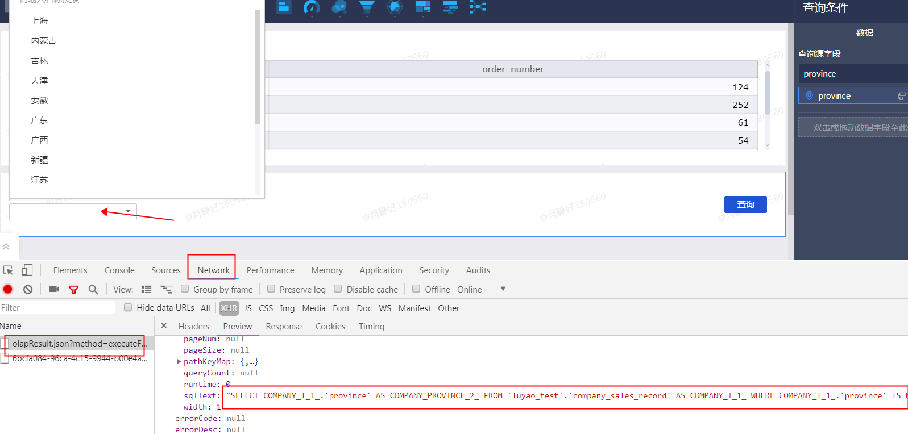

#### Q1:仪表板交叉表中可以设置数据条件格式吗？（不同数据颜色，绿色、红色）

##### A:如果是行列混布，暂时无法设置了，如果列字段都是度量，才能设置。

#### Q2:仪表板交叉表，每次查询生产的宽度 不一样，能自定设置吗？

##### A:只能手动调整，拖动一下

#### Q3:交叉表数据导出后，合并单元格等样式也没有了，能否导出格式和显示一至。

##### A:交叉表导出数据，单元格都不会合并；电子表格可以保持合并单元格

#### Q4:仪表板上的汇总，可以做行的汇总吗？

##### A:目前不支持,只能做列的汇总

#### Q5:电子表格单元格合并，导致部分内容不显示

##### A:因为手动设置合并单元格导致  合并单元格设置的格式被固定了,前面会覆盖后面的内容。

#### Q6:仪表板（柱状图）设置颜色图例，保存后，重新查询，图例颜色又变成默认的了（即设置颜色图例没有效果，只能默认颜色）

##### A:这个地方是有问题的，是否修复，阿里讨论中

#### Q7:电子表格数据格式显示异常（颜色红色,数据格式也显示异常）
##### A:阿里正在修复中，2月底更新发布会修复。

#### Q8:在过滤条件中设置了固定排序，但是在显示的时候没有安装设置的顺序排序

##### A:有可能做了行列互换（即维度放在列上），行列互换是在固定值排序之后处理的 固定值排序功能就不生效了

#### Q9:电子表格中 有隐藏行和列，但是隐藏之后没找到取消隐藏的地方

##### A:同时选中被隐藏行的左右两行 右键选择“显示”即可

#### Q10:quickBI在数据量较大的时候，在仪表版加载数据的时间较长，有时候还会超时时怎么回事？

##### A:quickBI取数的时候都是先生成sql，然后将sql放到数据源的数据库中运行，消耗时间基本都是在数据源里运行sql的，在quckBi耗时比较短。如果时间超过5分钟就会超时。想要提高加载速度就要对数据源进行优化，比如使用阿里的分析数据库ADS.

#### Q11:数据集没有绑定任何的图表，单独的一个查询控件，显示出可选择的枚举选项都非常慢是什么原因？

##### A:查询这个枚举值是全表扫描的  如果数据量大的话，可能会比较慢。可以在浏览器控制台获取下sql 放在数据源中中运行速度相差多少。

#### Q12:在配置邮件订阅的时候，邮件订阅里有用户显示是灰色，实际也没收到邮件，是什么原因？

##### A:灰色代表这个账号没有配置有效邮箱，该灰色账户登录QuickBi 在个人设置中配置邮箱即可。

