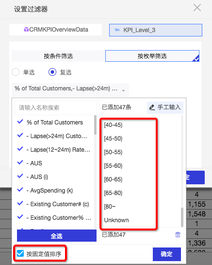
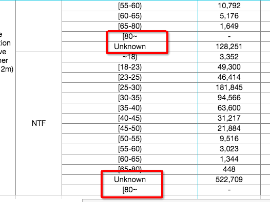

##### Q1:仪表板交叉表中可以设置数据条件格式吗？（不同数据颜色，绿色、红色）
##### A1:如果是行列混布，暂时无法设置了，如果列字段都是度量，才能设置。
##### Q2:仪表板交叉表，每次查询生产的宽度 不一样，能自定设置吗？
##### A2:只能手动调整，拖动一下
##### Q3:交叉表数据导出后，合并单元格等样式也没有了，能否导出格式和显示一至。
##### A3:交叉表导出数据，单元格都不会合并；电子表格可以保持合并单元格
##### Q4:仪表板上的汇总，可以做行的汇总吗？
##### A4:目前不支持,只能做列的汇总
##### Q5:电子表格单元格合并，导致部分内容不显示
##### A5:因为手动设置合并单元格导致  合并单元格设置的格式被固定了,前面会覆盖后面的内容。
##### Q6:仪表板（柱状图）设置颜色图例，保存后，重新查询，图例颜色又变成默认的了（即设置颜色图例没有效果，只能默认颜色）
##### A6:这个地方是有问题的，是否修复，阿里讨论中
##### Q7:电子表格数据格式显示异常（颜色红色,数据格式也显示异常）
##### A7:阿里正在修复中，2月底更新发布会修复。
##### Q8:在过滤条件中设置了固定排序，但是在显示的时候没有安装设置的顺序排序

##### A:有可能做了行列互换（即维度放在列上），行列互换是在固定值排序之后处理的 固定值排序功能就不生效了
